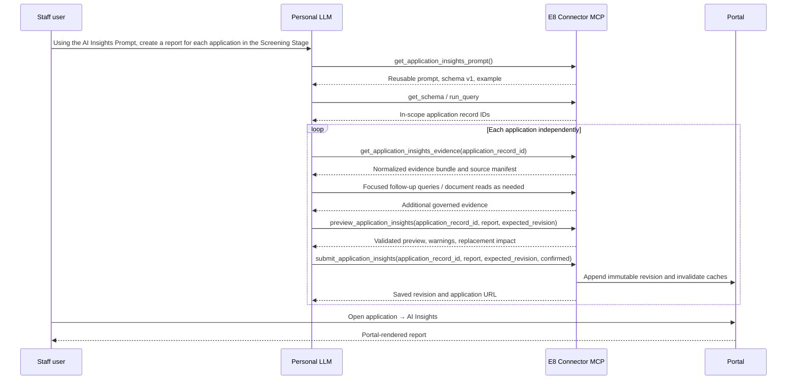

# Connector-authored Application AI Insights

## 1. Executive recommendation

Replace the portal-generated `screening_review_analysis` with versioned, connector-authored reports. A staff user can give their personal LLM a scope such as “each application in the Screening Stage.” The agent retrieves the portal-owned prompt and report contract once through MCP, resolves the requested application set and exact `applications.record_id` values with the governed connector tools, and independently researches, previews, and submits a report for each application. Each application page renders its newest revision in the AI Insights tab.

Use a versioned JSON report document, not arbitrary HTML, CSS, JavaScript, or uploaded chart images. The report schema should expose semantic presentation primitives—stat bands, callouts, issue lists, responsive grids, tables, charts, questions, and sources—while the portal owns typography, spacing, colors, responsive behavior, accessibility, and link safety. This provides most of the design freedom in the supplied Claude artifacts without making model output executable.

The prompt should include:

- the analytical assignment and evidence standards;
- instructions for resolving the requested application scope and preserving each exact application identity;
- instructions for retrieving portal and document evidence with the existing MCP tools;
- the complete versioned report schema;
- a compact but realistic sample document using every important presentation primitive;
- explicit prohibitions against raw HTML/CSS/JavaScript, invented component types, raw Drive URLs, and unsupported claims.

Charts should be declarative data in the report and rendered with the portal's existing Recharts dependency. Phase 1 does not need image storage.

The complete human-authored prompt—including analytical instructions, formatting guidance, and the exemplar—lives in the `diligence_prompts` AI Prompts table under the `screening_review` token, with normal version history. It is not a code constant. The tool injects the code-generated current JSON Schema into that database-authored prompt so staff can iterate on instructions and examples without a deployment while the server continues to enforce the renderer contract.

The working agent instructions and formatting example are maintained in [prompt-draft.md](prompt-draft.md) while the prompt is being reviewed.

## 2. Evidence from the supplied examples

The three examples use a common visual vocabulary even though their layouts differ:

- a report header with company identity, prepared date, and a dense top stat strip;
- short executive framing followed by structured decision issues;
- status- or topic-colored tags and left-edge accents;
- two- to four-column compositions that collapse on narrow screens;
- callout boxes for prior contact, caveats, or interpretation;
- dense comparison and verification tables;
- numbered open-question lists and source lists;
- section kickers, captions, and provenance notes;
- a chart embedded in the PittMoss report as accessible inline SVG with a textual `aria-label` containing the plotted values.

The portal can reproduce these patterns from semantic data. It should not reproduce the artifacts' hard-coded fonts or colors; those map to E8 design tokens.

## 3. Current-state findings

The displayed value is `application_ai_outputs.screening_review_analysis`. It is currently generated or regenerated from several independent paths:

1. `AIAnalyzer.generateApplicationSummary()` normally calls the combined OpenAI prompt and stores a screening analysis as a side effect.
2. `AIAnalyzer.generateScreeningReviewAnalysis()` and `generateScreeningReviewPrompt()` call OpenAI directly.
3. `POST /screening-review/api/generate-analysis` supports normal and hard regeneration.
4. `POST /screening-review/api/batch-generate-analysis` creates missing analyses for a stage.
5. `POST /screening-review/api/generate-ai-element` exposes `screeningReviewAnalysis` to admins.
6. The nightly `ai_pipeline` scheduled job treats the analysis as a required missing element.
7. Supplemental-document processing in both the web process and supplemental worker creates the analysis when absent.
8. The AI Insights tab exposes Generate and Regenerate controls that call these routes.
9. RAG indexing incorporates the generated analysis into company training content.

Application summaries, visual pitch-deck analysis, brief summaries, decision messages, supplemental-document integration, and company indexing are separate useful capabilities and should remain. Their current coupling to screening analysis must be removed carefully.

The present display path also has a security flaw that the replacement must close: `markdownToHtmlSimple()` returns strings that look like HTML unchanged, and `MarkdownField` inserts them with `dangerouslySetInnerHTML`. Connector-authored content cannot reuse that trust model.

## 4. Proposed user and agent flow



The `expected_revision` precondition prevents two agents from silently overwriting one another. Every accepted submission appends a revision; no prior report is destroyed.

## 5. Report contract

### 5.1 Envelope

```json
{
  "schema_version": "e8.application-insights/v1",
  "title": "PittMoss Follow-On Review",
  "subtitle": "Returning portfolio · follow-on request",
  "prepared_on": "2026-09-06",
  "summary": "One-sentence accessible summary of the report's conclusion.",
  "blocks": []
}
```

The server validates the full payload with Zod and enforces bounded counts and text lengths before persistence. Unknown block types, keys, tones, chart types, link schemes, or malformed values fail closed.

### 5.2 Block types

| Block | Purpose | Important options |
| --- | --- | --- |
| `hero` | Company identity and report context | eyebrow, title, description, metadata |
| `stats` | Full-width top stat band | 2–6 labeled values, optional detail and tone |
| `callout` | Prior contact, caveat, thesis, warning | title, body, tone |
| `section` | Heading and ordered child blocks | kicker, heading, caption, children |
| `columns` | Responsive layout | 2–4 columns, relative spans, gap density |
| `issue_list` | “What doesn't hold up” and similar findings | tag, title, body, tone, optional evidence status |
| `prose` | Paragraphs with safe inline emphasis and links | structured inline nodes, not HTML |
| `list` | Bulleted, numbered, or numbered-card lists | style, items, start number |
| `table` | Comparisons and evidence matrices | caption, columns, rows, alignment, cell tones |
| `metric_grid` | Compact label/value calculations | label, value, detail, tone |
| `chart` | Bar, line, area, column, stacked-column charts | categories, series, units, axes, legend, caption, accessible summary |
| `sources` | Public and internal provenance | numbered sources, safe URLs, labels, notes |
| `divider` | Intentional section separation | emphasis only |

Fields declared as `rich_text` support a documented safe Markdown subset: strong, emphasis, inline code, descriptive `https` links, paragraph breaks where allowed, and numbered source markers such as `[1]`. Titles, headings, callout and issue titles, and table cells allow inline formatting but remain single-line. Bodies, descriptions, captions, and list items also allow paragraph breaks. Structural Markdown such as headings, lists, tables, images, and raw HTML is rejected because the report has dedicated blocks for those structures. The renderer turns a valid source marker into a link to the corresponding numbered entry in the report's sources block.

Tone is semantic, not decorative:

| Tone | Meaning |
| --- | --- |
| `neutral` | factual content without an intended evaluative signal |
| `info` | explanatory context, methodology, or a notable supported fact |
| `positive` | evidence that materially supports a claim or the investment case |
| `caution` | uncertainty, a gap, dependency, or risk warranting attention |
| `critical` | a material contradiction, demonstrated failure, or strongly adverse finding |

The model chooses tone to express meaning; the portal chooses the corresponding colors, icons, borders, and emphasis. Validation should reject unsupported Markdown and unsafe links and should normalize rich text before rendering.

### 5.3 Charts

Chart payloads contain source data, not SVG paths or raster images. The renderer maps them to Recharts and E8 tokens. Require:

- `type`: `bar`, `horizontal_bar`, `line`, `area`, `column`, or `stacked_column`;
- categories and one or more named numeric series;
- a unit/format such as currency, percent, integer, decimal, or duration;
- a human-readable accessible summary that states the material trend and values;
- optional reference lines, missing-value markers, captions, and source notes;
- bounded series/category counts to keep charts legible and payloads safe.

Tables remain the preferred presentation when exact comparison is more important than shape. Charts and tables may appear together.

The model controls the analytical chart design: chart type, categories, series, ordering, grouping or stacking, units, semantic series tones, value-label preference, legend preference, annotations, reference lines, caption, and accessible summary. The portal renderer applies responsive sizing, typography, axes, grid lines, tooltip behavior, color tokens, and accessibility. This should match or improve the quality of ordinary bar, line, area, column, and stacked-column charts produced in a one-off model artifact while keeping them consistent and inspectable. Bespoke infographics, unusual statistical plots, and free-form diagramming are intentionally outside phase 1.

### 5.4 Images

Do not add image upload in phase 1. The requested chart types are better represented declaratively, stay crisp and accessible, inherit portal styling, and remain inspectable. If future reports need photographs or bespoke diagrams, add a separate governed asset-upload tool backed by portal file storage and `/api/files/:fileId`; never accept raw Drive URLs or base64 blobs inside the report JSON.

### 5.5 Preserving report richness

The risk of flattening every report into the same sequence of cards is real if the schema is treated as a fixed template. The contract must instead be a compositional document grammar: blocks may be omitted, repeated, reordered, and nested in responsive columns, subject only to safety and size bounds. The model chooses the narrative hierarchy, issue emphasis, tables, calculations, chart form, callouts, and density. The exemplar demonstrates capabilities but is not a required outline.

The schema intentionally gives up arbitrary DOM structure, custom CSS, executable behavior, bespoke fonts, and unconstrained graphics. Those freedoms add less analytical value than the composition and visualization choices retained by the grammar, while creating substantial security, accessibility, mobile, and long-term rendering risk. Acceptance testing should compare several materially different model-authored reports—not one golden template—to detect accidental sameness or loss of expressive range.

## 6. MCP surface

Add purpose-built tools to `lib/mcp/data-query-server.js` rather than making `application_ai_outputs` generically writable.

### `get_application_insights_prompt`

Read-only. No application-specific input. It returns:

- the fully composed prompt;
- `schema_version`, JSON Schema, allowed block/tone/chart vocabulary, and exemplar;
- the prompt revision/version so the saved report records which instructions produced it.

The prompt tells the agent to resolve the requested application scope and retrieve supporting data through existing governed tools. It does not duplicate a large, potentially stale application snapshot and can be reused for every application in a batch.

### `get_application_insights_evidence`

Read-only. Input: exact `application_record_id`. This is the standard starting point for each report so agents do not independently reinvent the same joins and retrieval plan. It returns a bounded, normalized evidence bundle containing the application and offer, company and team, prior applications, relevant E8 history, existing summaries, and current report revision, plus a source manifest for the pitch deck, supplemental documents, canonical diligence report, meeting notes, and other available evidence.

The bundle is not an undifferentiated text dump. Every item carries source type, record/document identity, date, provenance, and whether it is company-reported, E8-recorded, externally verified, or AI-derived. Large documents remain separate retrievable resources, and the bundle returns portal-safe URLs or follow-up tool instructions rather than embedding binary content. Optional section selection and continuation tokens keep responses within practical context limits. The agent must still inspect the pitch deck visually and perform external research where material.

### `preview_application_insights`

Read-only annotation and no mutation. Inputs: `application_record_id`, `expected_revision`, and `report`. It validates schema, bounds, application access, links, report/application identity, and optimistic concurrency. It returns errors, non-blocking warnings, a compact structural summary, and the fact that submission will make a new current revision.

### `submit_application_insights`

Write tool. Inputs match preview plus `confirmed: true`. It repeats all validation, appends the next revision atomically, records actor/client/prompt metadata, invalidates application caches, and returns revision metadata and the application URL. Submission should be idempotent by a caller-supplied `request_id` or content hash so retries cannot create duplicate revisions.

All four calls use existing MCP OAuth identity, permission resolution, and activity audit. The submit tool should never accept a company ID as a substitute for `applications.record_id`.

## 7. Persistence and provenance

Create an immutable `application_insight_reports` table rather than expanding the mixed-purpose `application_ai_outputs` row:

| Column | Purpose |
| --- | --- |
| `id` | Server-generated report revision ID |
| `application_record_id` | Exact application identity |
| `revision_number` | Monotonic per-application version |
| `schema_version` | Renderer contract version |
| `report_json` | Validated canonical JSON |
| `plain_text` | Deterministically derived accessible/search text |
| `prompt_token` / `prompt_version_id` | Prompt provenance |
| `created_by_person_record_id` | Authenticated MCP actor |
| `source_client_id` | Connector client provenance |
| `request_id` / `content_hash` | Retry deduplication |
| `created_at` | UTC instant |

Use `UNIQUE(application_record_id, revision_number)` and a uniqueness constraint for the retry key. “Current” is the highest revision, so rollback is forward-only: copying an old validated document creates a new revision. No production migration is part of implementation until Jordan explicitly approves the exact command.

Keep existing `screening_review_analysis` values untouched initially and render them through a sanitized legacy adapter only when no structured report exists. This avoids a destructive production backfill and allows gradual replacement. Stop all new writes to that column.

### 7.1 Ask AI availability and epistemic labeling

The newest report should be available to the application-scoped Ask AI feature, but only as derived analysis. Index deterministic plain text from the structured report with metadata including `source_kind: derived_ai_analysis`, `source: AI Insights report`, application record ID, report revision ID, prompt version, preparation date, and referenced source IDs. Never index it under a pitch deck, application, diligence report, or other primary-evidence category. Replacing a report must retire the prior revision's searchable chunks.

Ask AI retrieval and prompting must preserve this distinction:

- for opinions, risks, or synthesis, it may use the report but attributes conclusions explicitly, for example, “The AI Insights report identifies…”;
- for factual questions, it should prefer underlying application records and documents and use the report's source references to retrieve primary evidence where available;
- if a factual statement is available only in the AI Insights report, it must describe it as a claim or conclusion from that report rather than as independently established fact;
- the system prompt must state that AI Insights is model-authored analysis, not source-of-truth evidence;
- returned source labels must identify the report and revision rather than silently collapsing it into generic company context.

Apply the same derived-analysis label to legacy `screening_review_analysis` during the compatibility period. Add retrieval and response tests proving that an opinion from AI Insights is not restated as a verified company fact.

## 8. Portal rendering and UX

Replace the current `MarkdownField` path in `AIInsightsSection` with an `ApplicationInsightsReport` renderer. It should:

- render only typed React components—never `dangerouslySetInnerHTML` for structured reports;
- inherit the application page's `e8-page-shell`, content rail, typography roles, and design tokens;
- support the dense desktop compositions in the examples while collapsing columns, stat bands, and wide tables appropriately on mobile;
- use the shared table treatment and intentional horizontal scrolling only where exact dense comparisons require it;
- render charts responsively with Recharts, portal colors, accessible summaries, and optional data-table disclosure;
- expose prepared date and revision provenance without implying that the portal generated the analysis;
- show an empty state that tells staff to use the E8 Connector; remove Generate and Regenerate buttons;
- keep existing application-level access rules unchanged.

Recommended empty-state copy: “No AI Insights report has been submitted for this application. Ask an E8 staff member to generate one.”

## 9. Removing automatic generation cleanly

Remove only screening-review-analysis generation and its coupling:

1. Remove `screening_review_analysis` from the combined application-summary prompt contract and parser.
2. Make `generateApplicationSummary()` generate/store only application, primary, brief, and supplemental summaries.
3. Delete `generateScreeningReviewAnalysis()` and `generateScreeningReviewPrompt()` after all callers are removed.
4. Remove the single and batch generation routes and the `screeningReviewAnalysis` branch of the admin AI-element route.
5. Remove analysis presence/generation from the nightly `ai_pipeline` status and missing-element logic.
6. Remove analysis creation from synchronous and worker supplemental-processing paths.
7. Remove Generate/Regenerate callbacks, props, controls, confirmation copy, and related tests from the application UI.
8. Replace the current unqualified RAG indexing of screening analysis with the derived-analysis indexing and Ask AI attribution rules in section 7.1.
9. Keep read compatibility for existing legacy content until a separate approved retirement/migration removes the column.
10. Update admin pipeline-status UI and documentation so an absent connector report is not treated as a failed AI pipeline element.

## 10. Prompt management

Retain `diligence_prompts.screening_review` as the editable global prompt, but redefine it as the complete human-authored prompt returned by `get_application_insights_prompt`; it no longer drives a portal OpenAI call. Its versioned database content includes the analytical instructions, formatting rules, tone definitions, rich-text guidance, and exemplar so staff can iterate without redeploying. At request time, replace a schema placeholder with the JSON Schema generated from the code-owned validator. This separates editable guidance from the machine-enforced renderer contract without hard-coding the prompt or exemplar.

Update its friendly name and description in the prompt-management UI to “Application AI Insights.” Preserve prompt version history. A dev prompt migration can revise the seeded/default content; changing production prompt content requires a separately reviewed production write.

## 11. Confirmed authorization and publishing behavior

- only staff `read_write` connector sessions see preview/submit tools;
- prompt and evidence-bundle retrieval are also staff-only because they support production of internal screening analysis and expose a broad evidence set;
- portal visibility remains exactly the current application AI Insights permission;
- a submission creates a recoverable revision but immediately becomes current after the connector's normal preview/confirmation protocol;
- no in-portal report editor in phase 1.

## 12. Implementation sequence

### Phase 1 — Contract and persistence

- Define Zod schemas and JSON Schema export for `e8.application-insights/v1`.
- Add canonicalization, plain-text derivation, bounds, safe-link validation, and chart validation.
- Add bootstrap schema, migration script, CacheManager domain module, schema docs, relationship registry entry, and deletion/retention review.
- Add focused schema, persistence, retry-idempotency, concurrency, and invalid-payload tests.

### Phase 2 — MCP workflow

- Add prompt composition and the four purpose-built tools, including the normalized evidence bundle.
- Integrate permission filtering, activity audit, revision conflict handling, and application URL response.
- Update `docs/mcp-data-query-instructions.md` and connector guide.
- Add MCP list/call, read-only-tier hiding, validation, audit, and write tests.

### Phase 3 — Renderer

- Build typed report components and scoped report CSS using E8 design roles.
- Implement responsive stat bands, callouts, grids, issue lists, tables, metric grids, questions, sources, and Recharts charts.
- Add legacy Markdown sanitization/fallback and the connector empty state.
- Add component tests plus desktop and mobile authenticated screenshot verification using a rich fixture modeled on all three artifacts.

### Phase 4 — Remove generation machinery

- Decouple application-summary generation and delete every automatic/manual screening-analysis path listed above.
- Remove stale prompt output fields, routes, admin controls, UI controls, worker logic, and tests.
- Replace unqualified screening-analysis RAG chunks with revisioned, derived-analysis chunks and update Ask AI attribution behavior.
- Prove application summary, visual analysis, supplemental integration, decision messaging, worker indexing, and conversational Ask AI still function through focused regressions.

### Phase 5 — End-to-end verification and rollout

- Exercise prompt → governed research → preview → submit → application display with an MCP test client.
- Verify stale-revision conflicts, duplicate request retries, malformed documents, unauthorized callers, missing applications, long reports, external links, and chart edge cases.
- Run targeted server tests, renderer tests, MCP contract/instruction tests, build, authenticated application smoke, and desktop/mobile screenshots.
- Apply the production schema migration and prompt revision only after explicit approval; no deployment is implied by implementation approval.

## 13. Acceptance criteria

- The portal makes no OpenAI call to create or refresh application AI Insights.
- No scheduled, upload, supplemental-document, admin, or application-summary path writes new `screening_review_analysis` content.
- A staff personal LLM can retrieve one complete current prompt without first selecting an application.
- The agent can resolve every application in a requested stage and validate and submit a separate versioned report for each through the connector.
- Each application has one normalized, provenance-rich evidence-bundle call that covers the standard retrieval baseline and points to large documents for follow-up inspection.
- The newest report appears on that application's AI Insights tab without raw HTML execution.
- The report can express the supplied examples' stat bands, callouts, colored issue tags, columns, comparison tables, metric grids, numbered questions, sources, and common chart types.
- Typography, colors, spacing, and responsive behavior come from the E8 portal.
- Charts are data-backed, responsive, and accessible; no raster asset is required.
- The model can vary report composition and use the documented rich-text subset and semantic tones without being forced into one fixed template.
- Ask AI can retrieve the current report while consistently identifying its content as model-authored analysis and preferring underlying evidence for factual answers.
- Previous report revisions remain recoverable and concurrent submissions cannot silently overwrite each other.
- Existing legacy reports continue to display until replaced unless Jordan chooses a clean cutover.
- Application summaries, pitch-deck analysis, decision messages, supplemental processing, Ask AI, and relevant indexing continue to work.

## 14. Confirmed product decisions

Confirmed September 14, 2026:

1. Existing `screening_review_analysis` reports remain visible until individually replaced.
2. A successfully previewed connector submission becomes current immediately while retaining immutable revision history.
3. Prompt retrieval and submission are limited to staff `read_write` connector sessions.
4. Phase 1 prohibits arbitrary HTML, CSS, JavaScript, and uploaded images; the versioned report schema provides structured layouts and declarative charts.
5. The report is written primarily for Screening, but should remain useful to later diligence-team and potential-investor readers across E8.
6. Positive findings should be included when material, without requiring a dedicated “What holds up” section.
7. Report length is evidence-proportionate rather than fixed.
8. Claims use linked numbered footnote markers such as `[1]`, with full internal or external source details in the numbered sources section.
9. Stage and location are not required report-header metadata.
10. The full human-authored prompt and exemplar live in the versioned AI Prompts database table; only the enforced schema and its generated documentation are code-owned.
11. A purpose-built evidence-bundle tool provides the standard per-application retrieval baseline; it is structured and provenance-rich rather than a single unbounded text dump.
12. AI Insights remains searchable by Ask AI as explicitly labeled derived analysis, never as primary evidence.

## 15. Out of scope for phase 1

- portal-hosted LLM generation of application AI Insights;
- arbitrary HTML, CSS, JavaScript, iframes, canvas instructions, or model-supplied SVG;
- image/chart upload and image lifecycle management;
- collaborative in-portal editing or approval queues unless selected in question 2;
- automatic regeneration when application data changes;
- deletion or production backfill of existing legacy analyses;
- changes to Portfolio Insights.
